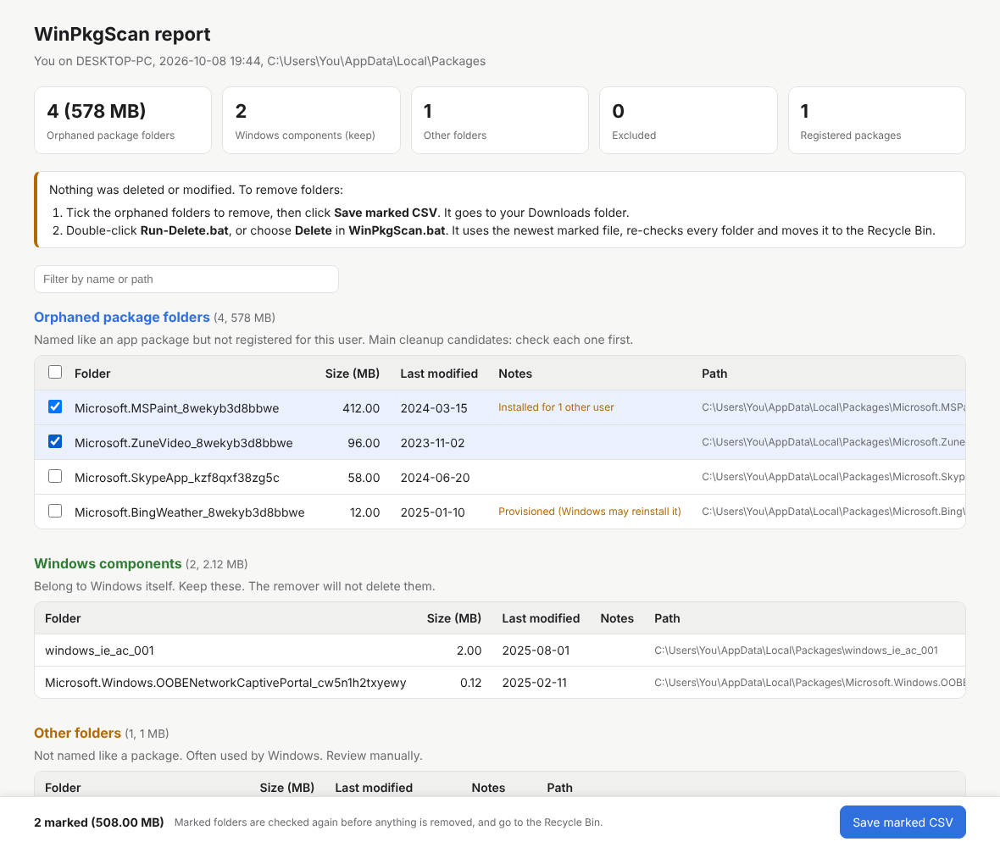

# WinPkgScan


Finds leftover app folders in `%LOCALAPPDATA%\Packages` whose app is no longer installed for the current Windows user, and lets you remove the ones you choose, safely.

- **The scanner is read-only.** It lists each folder with its size and last-modified date, and saves a text report, a CSV and an HTML report to your Desktop.
- **You choose what goes.** Tick folders in the HTML report, or mark them in the CSV.
- **The remover re-checks every folder,** moves it to the Recycle Bin, and logs what it did.
- **Restore puts them back** from the Recycle Bin, using that log.



## Download

1. Download `WinPkgScan-vX.Y.Z.zip` from the [latest release](https://github.com/leaurix/WinPkgScan/releases/latest).
2. Right-click the zip > **Properties** > tick **Unblock** > **OK**. This stops Windows from warning about files downloaded from the internet.
3. Extract it and double-click `WinPkgScan.bat`.

Optional: check the download is intact. The hash must match the `.sha256` file on the release page.

```powershell
Get-FileHash .\WinPkgScan-v1.6.0.zip -Algorithm SHA256
```

## Why

When a Microsoft Store (AppX/MSIX) app is removed, its data folder in `AppData\Local\Packages` is sometimes left behind. Over time these folders can take up significant disk space. WinPkgScan finds them and lets you clean them up safely.

## Quick start

Double-click `WinPkgScan.bat` and use the menu:

```
  1  Scan and open the HTML report
  2  Scan as administrator - extra checks
  3  Open the last HTML report
  4  Preview delete - changes nothing
  5  Delete marked folders - Recycle Bin, asks before each one
  6  Restore folders from the last delete
  7  Edit exclusions
  8  Help - README
  0  Exit
```

1. **Scan (1):** saves the report, CSV and HTML to your Desktop and opens the HTML report.
2. **Mark:** in the HTML report, tick the orphaned folders to remove and click **Save marked CSV**. It goes to your Downloads folder.
3. **Preview (4):** shows what would be removed. Nothing is changed.
4. **Delete (5):** answer `Y` for each folder, or `A` for all. Folders go to the Recycle Bin.
5. **Undo (6):** puts the folders from the last delete back.

Prefer Excel? Open `Orphaned-Appx-Packages.csv` from the Desktop, type `Yes` in the **Delete** column, save it as CSV and close Excel. The remover uses whichever marked file is newest.

## How the scanner works

1. Reads every package registered for the current user (`Get-AppxPackage`, all package types).
2. Lists every folder in `%LOCALAPPDATA%\Packages`.
3. Skips any folder whose name matches a registered Package Family Name (case-insensitive), e.g. `Microsoft.WindowsStore_8wekyb3d8bbwe`.
4. Leaves out folders matching your exclude patterns.
5. Sorts the remaining folders into three groups:
   - **Orphaned package folders:** named like a package (`Name_` plus a 13-character publisher ID) but not registered. These are the main cleanup candidates.
   - **Windows components (keep):** from the Windows publisher (`_cw5n1h2txyewy`) or `windows_ie_ac_*`. Shown so you can see them. The remover will not delete them.
   - **Other folders:** not named like a package. Often used by Windows. Listed separately for review.
6. Calculates each folder's size and last-modified date (newest file inside it), and sorts each group largest first.
7. Prints the results and writes a text report, plus a CSV and an HTML report if asked.

### Administrator checks

Run the scan as administrator (menu option 2) for two extra checks:

- **Unfinished registrations:** apps that Windows still has registered to you in an unfinished state, such as staged or pending, are kept out of the results. A normal scan cannot see these.
- **Notes:** each folder gets notes such as **Provisioned (Windows may reinstall it)** or **Installed for 2 other users**. These help you decide. They do not block removal, because a folder in your profile is only used by you.

They run automatically when the scan runs as administrator. Use `-AdminChecks Off` to skip them, or `-AdminChecks On` to try them anyway. If they fail, the scan carries on with a warning.

## Requirements

- Windows 10 or 11
- Windows PowerShell 5.1 (built in) or PowerShell 7+
- No administrator rights needed (they add the extra checks above)

## Files

| File | Purpose |
|---|---|
| `WinPkgScan.bat` | **Start here.** Menu for scan, report, preview, delete, restore and exclusions. |
| `Find-OrphanedAppxFolders.ps1` | The scanner (read-only) |
| `Remove-OrphanedAppxFolders.ps1` | The remover |
| `Restore-OrphanedAppxFolders.ps1` | Puts removed folders back from the Recycle Bin |
| `Run-Scan.bat` | Scan only. Saves the report, CSV and HTML, and opens the HTML report. |
| `Run-Scan-Unattended.bat` | Scan for Task Scheduler or other scripts. No prompt, returns an exit code. |
| `Run-Delete.bat` | Remove the marked folders, or drag a CSV onto it. |
| `WinPkgScan.exclude.txt` | Your exclude list. One folder name or wildcard pattern per line. |

Keep these files in the same folder. The other files (`tests/`, `docs/`, `build.ps1`, `.github/`) are only for development.

### Direct commands

`WinPkgScan.bat` also runs single steps without the menu or pauses, for scripts and Task Scheduler. Extra options are passed to the script:

```bat
WinPkgScan.bat scan                     :: scan, saves CSV and HTML
WinPkgScan.bat preview                  :: what would be removed
WinPkgScan.bat delete -Force            :: remove marked folders, no prompts
WinPkgScan.bat restore -Name "Contoso.*"
```

## Scanner usage

**Easiest:** menu option 1, or double-click `Run-Scan.bat`.

**From PowerShell:** open PowerShell in the script's folder and run:

```powershell
powershell -ExecutionPolicy Bypass -File .\Find-OrphanedAppxFolders.ps1 -Csv -Html -Open
```

`-ExecutionPolicy Bypass` applies to this run only and does not change your system settings.

### Scanner options

| Parameter | Description |
|---|---|
| `-NoPause` | Skip the "Press Enter to exit" prompt. Use for scheduled or unattended runs. |
| `-ReportPath <path>` | Save the report to a custom location instead of the Desktop. |
| `-Csv` | Also save the results as a CSV next to the report. |
| `-Html` | Also save the HTML report next to the report. |
| `-Open` | Open the HTML report when the scan finishes. |
| `-Exclude <patterns>` | Leave out folders matching these names or wildcards, e.g. `-Exclude 'Contoso.*','*Teams*'`. |
| `-ExcludeFile <path>` | Use a different exclude file. Defaults to `WinPkgScan.exclude.txt` next to the script. |
| `-AdminChecks <Auto\|On\|Off>` | Administrator checks. `Auto` (default) runs them when elevated. |

`Run-Scan.bat` adds `-Csv` and `-Html` itself, and `-Open` when double-clicked.

### Scanner output

- **Console:** summary counts and sizes for each group, plus a table per group (name, size, last modified, notes).
- **Report file:** `Orphaned-Appx-Packages.txt` on your Desktop (OneDrive-redirected Desktops are detected), or the path given in `-ReportPath`.
- **CSV file:** same name with a `.csv` extension. Columns: `Delete` (empty, for you to fill in), `Category`, `FolderName`, `SizeMB`, `LastModified`, `FullPath`, `Status`, `Notes`.
- **HTML report:** same name with a `.html` extension. Summary tiles, one table per group, click a column header to sort, a filter box, and tick boxes with **Save marked CSV** for orphaned folders. Follows your light or dark mode.

Example report entry:

```
Folder        : Contoso.SampleApp_abc123def4567
Size          : 412.57 MB
Last Modified : 2024-03-15
Path          : C:\Users\You\AppData\Local\Packages\Contoso.SampleApp_abc123def4567
Status        : NOT CURRENTLY REGISTERED
Notes         : Provisioned (Windows may reinstall it)
```

## Excluding folders

To keep a folder out of the results for good, add its name to `WinPkgScan.exclude.txt` next to the scripts (menu option 7 opens it):

```text
# Lines starting with # are ignored
Contoso.MyApp_abc123def4567
Contoso.*
*Teams*
```

`*` matches anything and `?` matches one character. Matching ignores upper and lower case. The remover reads the same file, so excluded folders are never deleted, even if marked. For a one-off run, use `-Exclude` instead.

## Removing folders

Mark folders in the HTML report (**Save marked CSV**) or in the CSV (type `Yes` in the **Delete** column; `Y`, `True`, `1` and `X` also work). Then use menu option 5, `Run-Delete.bat`, or:

```powershell
.\Remove-OrphanedAppxFolders.ps1 -WhatIf     # preview only
.\Remove-OrphanedAppxFolders.ps1             # Recycle Bin, asks before each folder
```

**Which file is used:** without `-CsvPath`, the remover takes the newest of `Orphaned-Appx-Packages.csv` and `WinPkgScan-marked*.csv` on your Desktop and in your Downloads folder, and shows which one. CSV files saved by browsers, PowerShell or Excel (any encoding, `,` or `;` separator) are all read correctly.

### Safety checks

Every marked folder is checked again just before it is removed. It is **skipped** if:

- it is not directly inside `%LOCALAPPDATA%\Packages` of the current user, or its `FolderName` and `FullPath` do not match
- it no longer exists, it is a link or junction, or it contains one (links are never followed)
- it is registered to an installed app right now, or (as administrator) still known to Windows for you in an unfinished state
- it matches an exclude pattern
- it is a Windows component, unless you use `-IncludeWindowsComponents` (not recommended)
- it is not package-named (an "Other folder"), unless you use `-IncludeOtherFolders`
- anything inside it changed in the last 30 days (change with `-MinAgeDays`)

If the list of installed packages cannot be read, nothing is removed.

### Remover options

| Parameter | Description |
|---|---|
| `-CsvPath <path>` | The CSV to read. See "Which file is used" above. Can be given first without the name. |
| `-SearchFolder <folders>` | Where to look when `-CsvPath` is not given. Defaults to Desktop and Downloads. |
| `-WhatIf` | Show what would be removed. Nothing is changed. |
| `-Permanent` | Delete permanently instead of moving to the Recycle Bin. Cannot be restored. |
| `-Force` | Do not ask before each folder. Needed for unattended runs. |
| `-MinAgeDays <n>` | Skip folders with anything changed in the last `n` days. Default `30`. `0` turns this off. |
| `-IncludeOtherFolders` | Also allow folders that are not package-named. |
| `-IncludeWindowsComponents` | Also allow Windows component folders. Not recommended. |
| `-Exclude <patterns>` | Never delete folders matching these names or wildcards. |
| `-ExcludeFile <path>` | Use a different exclude file. Defaults to `WinPkgScan.exclude.txt` next to the script. |
| `-AdminChecks <Auto\|On\|Off>` | Administrator checks. `Auto` (default) runs them when elevated. |
| `-LogPath <path>` | Where to save the log. Defaults to `WinPkgScan-DeleteLog-<date-time>.csv` next to the input CSV. |
| `-NoPause` | Skip the "Press Enter to exit" prompt. |

### Remover output

- **Console:** one line per marked folder (`Recycled`, `Deleted`, `WhatIf`, `Skipped` or `Failed`, with the reason), then a summary with the space freed.
- **Log CSV:** columns `Time`, `Action`, `FolderName`, `SizeMB`, `FullPath`, `Reason`. Restore reads this file.
- **Exit code:** `0` if nothing failed (skipped folders are not failures), `1` on an error or a failed delete.

## Restoring folders

Menu option 6, or:

```powershell
.\Restore-OrphanedAppxFolders.ps1 -WhatIf              # what would be restored
.\Restore-OrphanedAppxFolders.ps1                      # restore from the newest delete log
.\Restore-OrphanedAppxFolders.ps1 -Name 'Contoso.*'    # only some folders
```

It reads the newest `WinPkgScan-DeleteLog-*.csv` on your Desktop or in your Downloads folder (or `-LogPath`) and puts every `Recycled` folder back where it was. A folder is skipped if something already exists at its path, or if it is no longer in the Recycle Bin. Folders removed with `-Permanent` cannot be restored. You can always restore by hand from the Recycle Bin too.

## Limitations

- Scans the current user only. Other user profiles are not checked.
- A flagged folder is a candidate, not a confirmed orphan. Check each folder before marking it, and use the preview first.
- Files the script cannot access are skipped, so reported sizes may be lower than actual.
- If the installed package list cannot be read, the scanner stops instead of flagging every folder, and the remover stops without deleting.
- Windows deletes a folder permanently, instead of recycling it, if it is too large for the Recycle Bin. The size limit is set per drive in the Recycle Bin's properties.
- Close the CSV in Excel before deleting. Excel locks the file while it is open.

## Safety

The scanner only reads and reports. The remover deletes only what you mark, re-checks each folder first, uses the Recycle Bin by default, and logs everything so it can be restored. Removing folders is still your decision: check before you mark a folder, and preview first. An old last-modified date is a good sign a folder is unused, but it is not proof.

## Development

Install the tools once:

```powershell
Install-Module PSScriptAnalyzer, Pester -Scope CurrentUser -Force -SkipPublisherCheck
```

Run lint and tests:

```powershell
./build.ps1                                # lint + tests
./build.ps1 -Task Lint                     # PSScriptAnalyzer only
./build.ps1 -Task Test                     # Pester only
./build.ps1 -Task Package -Tag v1.6.0      # build the release zip into out/
```

- **Unit tests** mock `Get-AppxPackage` and use a fake Packages folder, so they run on any OS. Deletion is tested for real on the fake folders.
- **Integration tests** (tag `Integration`) run only on Windows. They scan the real user packages, recycle and restore a folder through the real Recycle Bin, and run the batch files.
- **CI** (`.github/workflows/ci.yml`) runs on every branch push and pull request: lint on Ubuntu, tests on Windows with PowerShell 5.1 and 7. Test results are uploaded as a build artifact.
- **Dependabot** (`.github/dependabot.yml`) opens a pull request when a GitHub Action used by the workflows has a new version.

### Releasing

1. Update the version in all three scripts, in both places in each: the `Version:` help line and `$ScriptVersion`.
2. Add a `## [X.Y.Z] - YYYY-MM-DD` section at the top of `CHANGELOG.md`.
3. Merge to `main` through a pull request, with CI green.
4. Tag and push:

   ```powershell
   git checkout main
   git pull
   git tag vX.Y.Z
   git push origin vX.Y.Z
   ```

The **Release** workflow (`.github/workflows/release.yml`) then runs the full CI. If CI passes, it builds the zip (the three scripts, the four batch files, the exclude file, README and LICENSE) and a SHA256 checksum, and publishes a GitHub Release. The release notes come from the CHANGELOG. The release fails if the tag does not match the script version or the CHANGELOG has no section for it.

Do not create the release by hand on GitHub: the workflow makes it. If one was made by hand anyway, or a release run failed, go to **Actions > Release > Run workflow**, enter the tag (e.g. `v1.6.0`), and run it. It attaches the zip and checksum to the existing release and replaces its title and notes.

## License

MIT. See [LICENSE](LICENSE).
